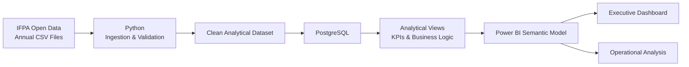

# IT Service Desk Analytics

> End-to-end **operational analytics** project using Python, SQL and Power BI to transform multi-year IT service desk records into decision-ready metrics, analytical models and dashboards.

[](https://www.python.org/)
[](https://www.postgresql.org/)
[](https://powerbi.microsoft.com/)
[](#project-status)

## Executive Summary

IT service desks generate large volumes of operational data, but raw ticket records rarely answer the questions managers actually care about: **where demand is growing, what creates bottlenecks, how workload is distributed and where improvement efforts should be prioritized**.

This project builds a reproducible analytics workflow around public IT service desk data from the **Instituto Federal do Pará (IFPA)**, covering records from **2020 to 2026**.

The portfolio goal is not merely to build a dashboard. It is to demonstrate an end-to-end workflow that combines:

- data ingestion and quality validation;
- reproducible transformation in Python;
- analytical modeling in PostgreSQL;
- KPI definition and SQL analysis;
- dimensional thinking for BI;
- executive and operational reporting in Power BI;
- documented assumptions, limitations and business interpretation.

## Business Questions

The analysis is designed to answer questions such as:

- How has ticket demand evolved over time?
- Which categories account for the highest workload?
- Which categories tend to remain open for longer?
- How is demand distributed by month, weekday and period?
- How does backlog change over time?
- Which areas show signs of operational bottlenecks?
- Which ticket characteristics are associated with slower resolution?
- Where should process-improvement efforts be prioritized?

> SLA metrics are only introduced when the source data supports a defensible calculation. The project intentionally avoids inventing KPIs that cannot be reproduced from the available fields.

## Analytics Architecture



More detail is available in [`docs/architecture.md`](docs/architecture.md).

## Data Pipeline

### 1. Source ingestion
Annual public datasets are collected and inspected separately before consolidation so schema changes and quality issues remain visible.

### 2. Data quality & standardization
Python is used to standardize column names and data types, parse dates, validate identifiers, profile missing values and detect inconsistencies across years.

### 3. Analytical storage
The curated dataset is loaded into PostgreSQL, where SQL is used to create reusable views, KPI logic and time-based analysis.

### 4. Business intelligence
Power BI consumes the analytical layer and presents both executive-level indicators and operational drill-down views.

## Core Metrics

Planned metrics include:

| Metric | Purpose |
| --- | --- |
| Ticket volume | Measure demand and workload evolution |
| Opened vs. closed tickets | Compare inflow and throughput |
| Backlog | Track unresolved demand over time |
| Resolution time | Identify slow categories and bottlenecks |
| Category mix | Understand workload concentration |
| Temporal distribution | Identify seasonality and recurring patterns |
| Aging of open tickets | Surface operational risk in unresolved demand |

Definitions and source fields are documented in [`docs/data_dictionary.md`](docs/data_dictionary.md).

## Repository Structure

```text
it-service-desk-analytics/
├── data/
│   ├── raw/             # Original public datasets
│   └── processed/       # Curated analytical outputs
├── docs/
│   ├── architecture.md
│   └── data_dictionary.md
├── notebooks/           # Exploration and data profiling
├── src/                 # Reusable Python pipeline code
├── sql/                 # Schema, views and analytical queries
├── powerbi/             # Power BI artifacts and documentation
├── tests/               # Data and transformation tests
├── .gitignore
├── requirements.txt
└── README.md
```

## Tech Stack

| Layer | Technology |
| --- | --- |
| Data preparation | Python, Pandas |
| Exploration | Jupyter Notebook |
| Analytical database | PostgreSQL |
| Querying & modeling | SQL |
| Business intelligence | Power BI, DAX |
| Version control | Git, GitHub |

## Project Roadmap

### Phase 1 — Data Understanding
- [x] Define analytical scope and repository structure
- [ ] Inspect annual schemas
- [ ] Profile missing values, duplicates and data types
- [ ] Document cross-year inconsistencies

### Phase 2 — Data Engineering
- [ ] Standardize annual datasets
- [ ] Build reproducible ingestion pipeline
- [ ] Validate ticket identifiers and dates
- [ ] Produce curated analytical dataset

### Phase 3 — SQL Analytics
- [ ] Load curated data into PostgreSQL
- [ ] Build analytical views
- [ ] Implement KPI calculations
- [ ] Add CTE, window-function and time-series analyses

### Phase 4 — Power BI
- [ ] Build semantic model
- [ ] Create executive overview
- [ ] Create operational analysis pages
- [ ] Add documented KPI definitions

### Phase 5 — Portfolio Delivery
- [ ] Add dashboard screenshots
- [ ] Document key findings
- [ ] Add reproducibility instructions
- [ ] Add final recommendations and limitations

## Project Status

**In progress — Data Understanding / Pipeline Design.**

The repository is intentionally being developed in stages so the Git history documents the evolution from raw public data to a finished analytical product.

## What This Project Demonstrates

From a portfolio perspective, this project is designed to demonstrate:

- translating an operational problem into measurable business questions;
- data quality assessment and multi-file ingestion;
- Python automation beyond notebook-only analysis;
- SQL analytical modeling and reusable business logic;
- dimensional and semantic modeling for Power BI;
- KPI design with explicit definitions;
- communication of technical work in business language;
- end-to-end ownership of an analytics solution.

## Data Source & Scope

The source consists of public IT Service Desk ticket data published by **IFPA** in annual CSV files. The available period spans **2020–2026**, with 2026 representing a partial year.

Core fields documented by the source include ticket ID, category, title, requester, opening date and closing date. Any metric that requires unavailable fields will be excluded or clearly identified as an approximation.

## Author

**Pablo Henrique da Silva Lima**  
Data & Analytics · Python · SQL · Power BI · Process Improvement

- [LinkedIn](https://www.linkedin.com/in/limapablo/)
- [GitHub](https://github.com/limapablo)
- [Portfolio](https://limapablo.com)
